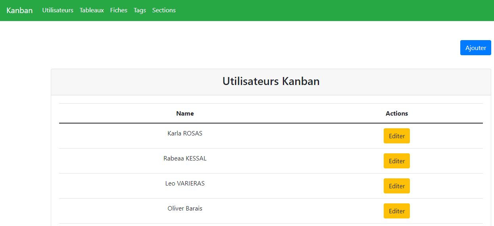
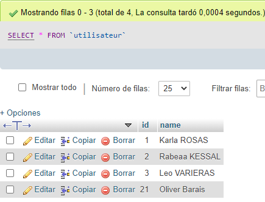
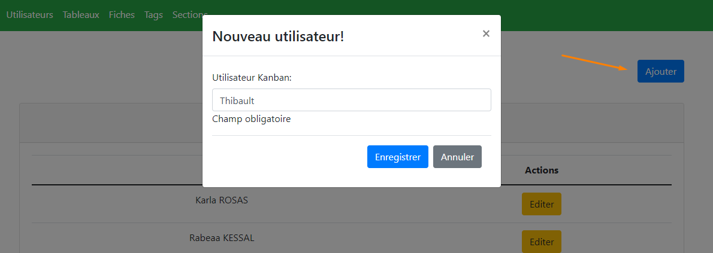
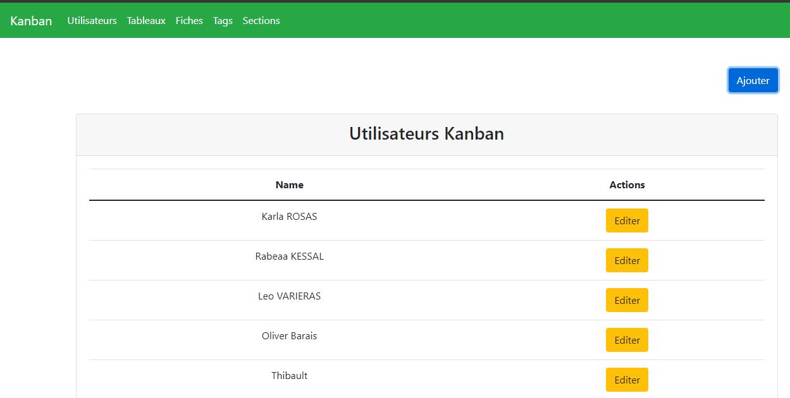
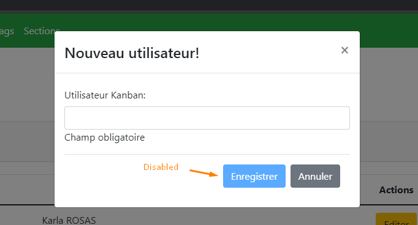
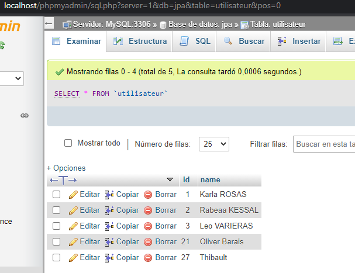
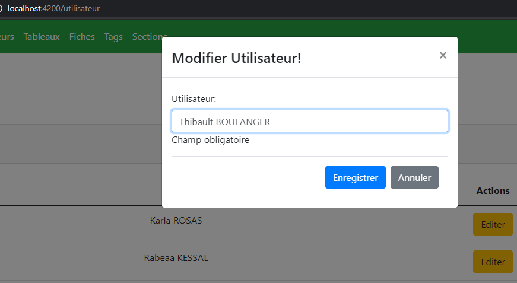
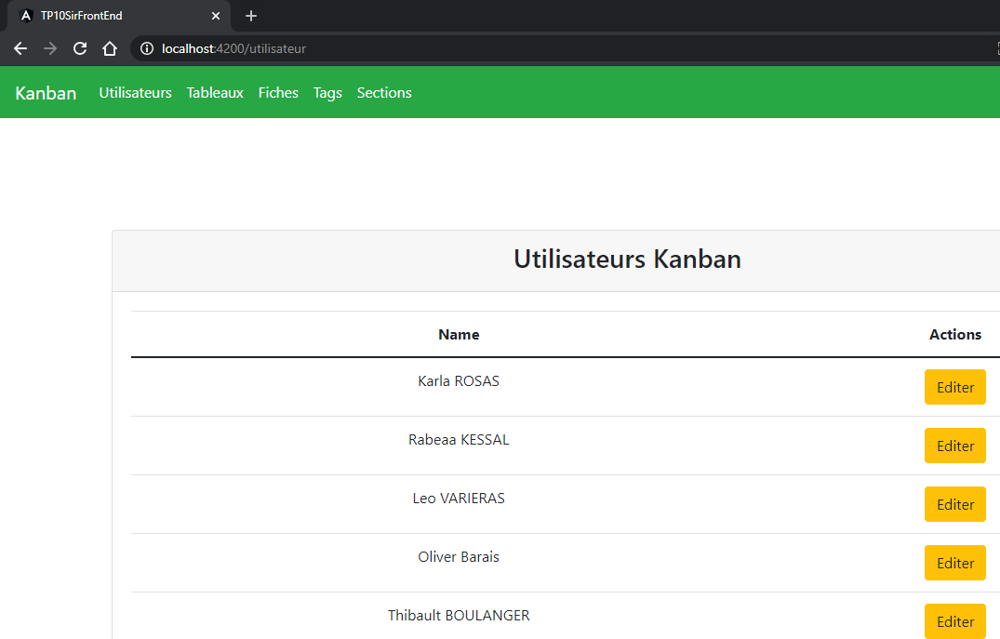
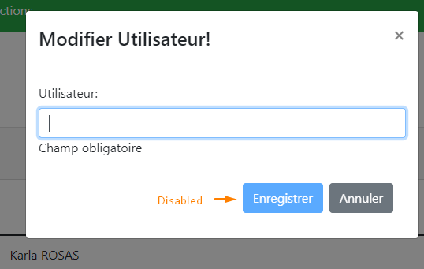
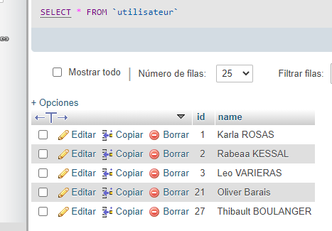

# TP10SirFrontEnd

This project was generated with [Angular CLI](https://github.com/angular/angular-cli) version 11.2.5.

# Frontend Kanban
## Prerequisites
### For Users
*  [Angular CLI] >= 11.2.5
* IDE  (Intelliji Idea, WebStorm)
* Run the backend project https://github.com/KarlaRosas/SIR_TD10_Backend 

## Getting Started
1. Clone: https://github.com/KarlaRosas/TP10SirFrontEnd.git
2. Start Backend server and database
3. Run `ng serve` for a dev server. Navigate to `http://localhost:4200/`. The app will automatically reload if you change any of the source files.

**How it works**

1. Test your implementations in Utilisateur Menu
2. **GET FRONTEND**
   
   **DATABASE**
   
   
   
3. POST
   **NEW USER**
   
  **RESULT NEW USER**
   
  **VALIDATION OF NULL**
   
  **DATABASE**
   
   
4. PUT
   **EDIT USER**
   
   **RESULT NEW USER**
   
   **VALIDATION OF NULL**
   
   **DATABASE**
   
   
   
**Authors**

* Rabeaa KESSAL
* Karla ROSAS
* Léo VARIERAS
